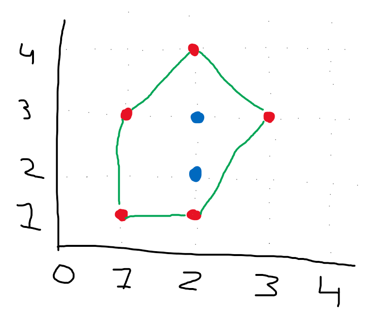

## Find minimum length fence to encompass all points on a 2d plane

Solution Language: C#

Given a set of points, find the minimum amount of fence needed to encompass all points

For example, given the following set of points:
`(1,1), (2,1), (2,2), (3,3), (2,3), (2,4), (1,3)`

We calculate the perimiter to be the nodes in `red` and the fence to be built is in `green` while the nodes inside of the perimeter, and thus not part of the fence, to be in `blue`: 

We return the set of points that would create the fence: `(1,1), (2,1), (3,3), (2,4), (1,3)`

This solution was created using Graham's Scan, references here:

[https://cp-algorithms.com/geometry/grahams-scan-convex-hull.html](https://cp-algorithms.com/geometry/grahams-scan-convex-hull.html) \
[https://algorithmist.com/wiki/Monotone_chain_convex_hull](https://algorithmist.com/wiki/Monotone_chain_convex_hull) \
[https://en.wikipedia.org/wiki/Graham_scan](https://en.wikipedia.org/wiki/Graham_scan) (I couldn't get the pseudo-code version from here to work)
